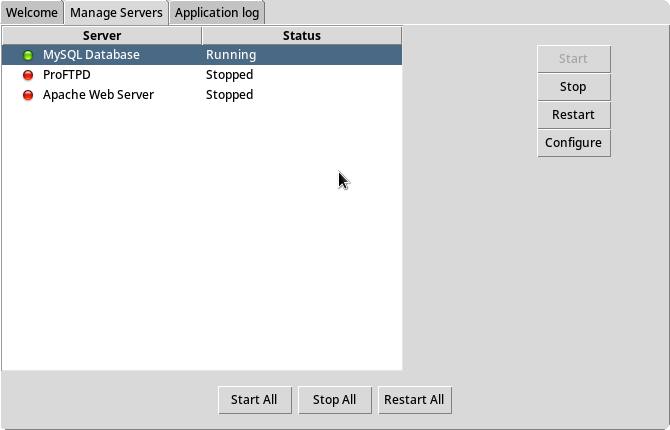
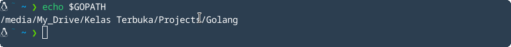
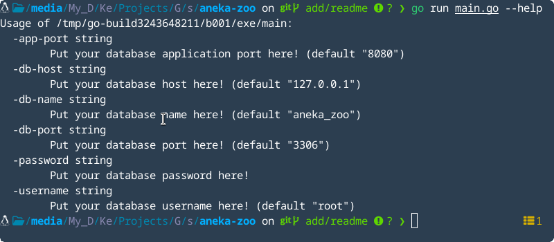

# Backend Tasks

This is a simple rest api that I made using the Go-Lang programming language. In this project to make it easier to build rest api with Go-Lang I use a library that is quite well known among Go programmers namely [`gorm`](https://gorm.io/index.html), [`gin`](https://github.com/gin-gonic/gin) and for data storage I use [`MySQL`](https://www.mysql.com/) and use [`gorm.io/driver/mysql`](gorm.io/driver/mysql) as drivers.

## Instructions

- Start your MySQL server for data storage.

  In this project I use `MySQL` for data storage so make sure you have `MySQL` installed. To make it easier here I use [`XAMPP`](https://www.apachefriends.org/download.html).
  Open your `XAMPP` or `MySQL` and start MySQL database server.

  

- Clone this project to your `GOPATH`.

  `GOPATH` is the variable used by Go to reference the location where all project folders are stored, except for those initialized using Go Modules. `GOPATH` contains 3 sub-folders: src , bin , and pkg

  `GOPATH` by default, the workspace directory is a directory that is named go within your user home directory (~/go for Linux and MacOS, %USERPROFILE%/go for Windows). But you can customize yourself where `GOPATH` you want.

  Here my `GOPATH`.
  

  So I did the command below. depending on where your `GOPATH` and go to the `src` folder. and make sure you have [`git`](https://git-scm.com/downloads) installed.
  <pre>
  <code>
    ~ cd "/media/My_Drive/Kelas Terbuka/Projects/Golang/src"
    ~ git clone https://github.com/irdaislakhuafa/aneka-zoo.git
    ~ cd aneka-zoo
  </code>
  </pre>

- Download modules dependencies

  I use several dependencies to make REST API easier to build, namely `gin`, `gorm` and `gorm.io/driver/mysql` as mysql driver. So we have to download it and do the command below in `aneka-zoo` project.

  <pre>
  <code>
    ~ go get -u github.com/gin-gonic/gin 
    ~ go get -u gorm.io/driver/mysql  
    ~ go get -u gorm.io/gorm  
  </code>
  </pre>

  If all the steps above are complete continue down.

- Run application

  First do the all command below in `aneka-zoo` project

   <pre>
   <code>
   ~ go run main.go
   </code>
   </pre>

### In this application I create 5 API urls which consist of :

1. Url `/api/animal/new` to create new animal data with http method `POST`. If you enter the same or duplicate data it will return a response message `"data already exists!"` and the data will not be saved.
2. Url `/api/animal/update/:id` to update or change data based on the id entered in the url. If the data is not in the database then the data will be saved as new data and this url uses http method `PUT`.
3. Url `/api/animal/delete/:id` this url is used to delete data based on the `id` entered in the url and if the data doesn't exist it will return the message `"data doesn't exists!"` and this url uses http method `DELETE`.
4. Url `/api/animal/get/:id` is used to search for `1` animal data based on the `id` entered from the url and if the data does not exist it will return the message `"data not found"`. This url uses http method `GET`.
5. Url `/api/animal/get/all` is used to get `all` animals data in database. This url uses http method `GET`.

I set up postman collections in `assets` folder for testing api in postman and I also set up the sample database in `assets` folder. You can easily change the `database name`, `username`, `password`, `application port`, and `others` by adding command line option flags just type the command `go run main.go --help` information will appear as below.

Example of flag usage :

<pre>
<code>
    ~ go run main.go -app-port=9000 -db-port=3306
</code>
</pre>

Then the application will run on port `9000` with database port `3306`.
